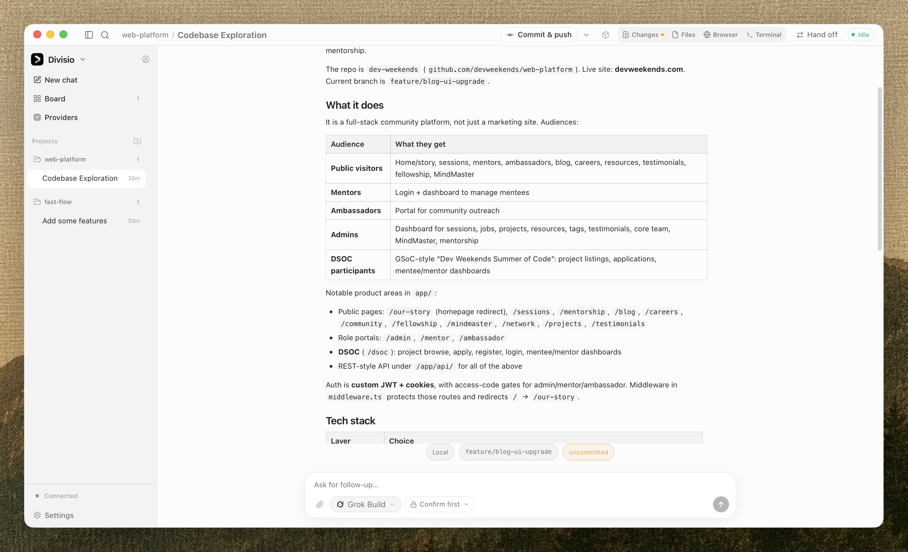
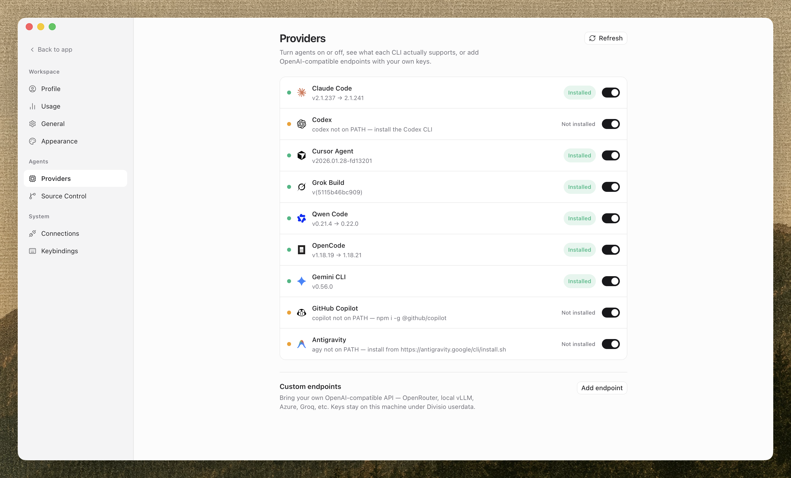

<div align="center">


# Divisio

**Every coding agent, in one workspace.**

Local-first command center for the coding agents you already pay for. Divisio
runs Claude Code, Codex, Cursor, Grok and five more side by side — under your own
CLI logins, on your own machine.

[](LICENSE)
[](#install)
[](https://bun.com)

[Download](https://github.com/junaiddshaukat/Divisio/releases/latest) ·
[Docs](docs/) ·
[Architecture](docs/architecture/overview.md) ·
[Adapter SDK](docs/sdk/adapter-sdk.md)

</div>



---

## What it is

Divisio is not a model and does not sell tokens. It is the workspace around the
agent CLIs you already pay for.

You keep your subscriptions. Each agent authenticates as you, exactly as it does
in your terminal — Divisio never sees a key. What it adds is everything those
CLIs do not give you on their own:

- **Warm sessions.** One process per thread, so a turn does not pay the CLI's
  cold boot every time you press send.
- **Parallel lanes.** Each lane is a real git worktree on its own branch, so four
  agents can work at once without touching each other's files.
- **Review before it lands.** Changed files appear under the reply that made
  them. Click one and it opens with that turn's edits highlighted.
- **Turn-level undo.** The working tree is snapshotted before and after every
  turn using hidden git refs. Roll one back without touching your branch.
- **Handoff.** Switch agent on a thread with history and the next one starts with
  a summary rather than a blank page.

## Install

**Download the app** — [latest release](https://github.com/junaiddshaukat/Divisio/releases/latest).
Signed and notarized, Apple silicon and Intel. The daemon is compiled into the
`.app`, so there is no runtime to install and nothing left running afterwards.

Then install at least one agent CLI and sign in to it. Divisio detects what is on
your machine and tells you how to install the rest.

## Supported agents

Divisio declares what each CLI can actually do, and the interface follows. Where
an agent will not hand over a decision, it says so rather than showing a control
that does nothing.

| Agent | Session | Approvals in Divisio | Notes |
| --- | --- | --- | --- |
| Claude Code | Warm | The CLI handles it | Streaming input over stdio |
| Codex | Warm | **Yes** | JSON-RPC app server |
| Cursor Agent | Warm | **Yes** | Agent Client Protocol |
| Grok Build | Warm | The CLI handles it | Agent Client Protocol |
| Qwen Code | Per turn | The CLI handles it | |
| OpenCode | Per turn | The CLI handles it | |
| Gemini CLI | Per turn | The CLI handles it | Community adapter |
| GitHub Copilot | Per turn | The CLI handles it | Community adapter |
| Antigravity | Per turn | The CLI handles it | Community adapter |

Any OpenAI-compatible endpoint also works — OpenRouter, a local vLLM, Azure,
Groq. Those keys stay on your machine under Divisio's userdata.



## Performance

Warm sessions are the whole point, so they are measured rather than asserted.
Same prompts, same machine, before and after:

| | Cold spawn per turn | Warm session |
| --- | --- | --- |
| First token | 5.9 s | **1.5 s** |
| A repeat turn | ~12 s | **616 ms** |
| Stop acknowledged | 2 000 ms | **42 ms** |
| Pre-turn snapshot, 6 700 files | 234 ms | **77 ms** |

Internal budgets — thread switch, event append, daemon start — are enforced as
release gates and run with `bun run bench`. See
[benchmarks](docs/operations/benchmarks.md) for method and caveats.

## Local-first

The daemon binds to loopback and requires a token even there; localhost is not a
trust boundary. There is no account, no telemetry, and no cloud component.

Optional LAN pairing lets you check on a long-running agent from another device.
It is off by default, revocable, and the daemon refuses to bind off loopback
without TLS or an encrypted overlay rather than quietly downgrading. See
[security](docs/architecture/security.md).

## Build from source

Requires [Bun](https://bun.com) 1.3.5+, [Rust](https://rustup.rs) for the desktop
shell, and at least one authenticated agent CLI.

```bash
bun install
bun run dev:desktop     # native window, bundled daemon, no token paste
```

First launch compiles the Tauri shell, which takes a few minutes. Later launches
are fast.

<details>
<summary>Web and daemon separately</summary>

```bash
bun run dev:server      # daemon on 127.0.0.1:4577
bun run dev:web         # UI on localhost:5173
```

Paste the token from `~/.divisio/userdata/auth-token` once — a browser cannot
read that file for you.

</details>

<details>
<summary>Packaging a signed macOS build</summary>

```bash
APPLE_SIGNING_IDENTITY="Developer ID Application: NAME (TEAMID)" \
  bun run build:desktop
```

Artifacts land in `apps/desktop/src-tauri/target/release/bundle/`. Notarization
credentials are read from `APPLE_ID`, `APPLE_PASSWORD` and `APPLE_TEAM_ID`.

</details>

```bash
bun test          # 359 tests
bun run typecheck
bun run bench     # latency gates
```

## How it works

A Bun daemon owns an append-only SQLite event log and hosts the provider
adapters. The React UI — the same build in the browser and in the Tauri window —
talks to it over one WebSocket.

Every vendor difference lives behind one adapter interface, in three tiers:
structured JSON-RPC, streaming NDJSON, and a PTY fallback. Orchestration and the
UI never speak a vendor protocol directly.

| Path | What it is |
| --- | --- |
| `apps/desktop` | Tauri shell — window and daemon supervisor |
| `apps/server` | Daemon: event log, WebSocket API, adapter host |
| `apps/web` | React UI, shared by web and desktop |
| `packages/contracts` | Events, commands, wire format, adapter interface |
| `packages/adapters` | First-party adapters and the SDK |
| `packages/community-adapters` | Gemini, Copilot, Antigravity |
| `packages/shared` | Branding, paths, ids, logging |

Decisions that would be expensive to revisit are written down as
[ADRs](docs/adr/) — why Tauri over Electron, why an event log without the CQRS
ceremony, why capabilities are declared rather than inferred.

## Adding an agent

A new agent is a module, not a fork. Implement the adapter interface, declare
what it can honestly do, and register it — the [adapter SDK
guide](docs/sdk/adapter-sdk.md) walks through it, and the community adapters are
working examples.

## Contributing

Issues and pull requests are welcome. [CONTRIBUTING.md](CONTRIBUTING.md) covers
the layout, the test story, and the conventions the codebase actually follows.

## License

[MIT](LICENSE)
