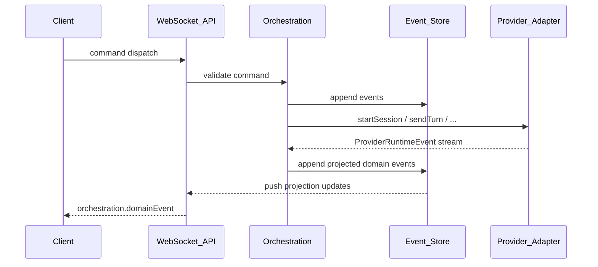

# Orchestration

Orchestration turns client intent into durable history and drives providers through adapters. It must stay **provider-agnostic**.

## Flow

## Command → event → projection

1. **Command** — client request (`thread.create`, `turn.send`, `turn.interrupt`, `approval.respond`, …)
2. **Validate** — reject bad commands before anything is written
3. **Append** — events go to the append-only log in SQLite with a monotonic `seq`
4. **Project** — read models (projects, threads, messages, activities) update in the same transaction
5. **Act** — talk to adapters, take git checkpoints; results come back as further events

Clients render projections. They do not invent server truth.

This is plain module code, not a mandated layering — see [ADR 0004](../adr/0004-event-sourced-orchestration.md). The append-only log is load-bearing (reconnect cursors, restart durability, checkpoint diffs, rebuildable projections). The framework vocabulary around it is not.

Every event carries `type` and a `v` schema version from the first event written. Versioning rules are in [ADR 0004](../adr/0004-event-sourced-orchestration.md#event-versioning--mandatory-from-the-first-event-written) and are not optional.

## Session lifecycle

| Status | Meaning |
| --- | --- |
| `connecting` | Spawning / attaching provider process |
| `ready` | Idle; accepts turns |
| `running` | Turn in progress |
| `awaiting_approval` | Blocked on user permission |
| `error` | Recoverable error surfaced to UI |
| `closed` | Session ended |

## Turns

A **turn** is one user→agent cycle, including tool calls and follow-up until the adapter signals completion (or interrupt/error).

Each completed turn should end with a **checkpoint** (hidden git ref or documented equivalent) so the UI can diff and restore. See ADR [0005-worktree-isolation](../adr/0005-worktree-isolation.md).

## Handoff (Phase 3)

Handoff is an orchestration feature, not an adapter hack:

1. Export a **continuation packet** from the source thread
2. Start or attach a session on the target provider
3. Seed the new turn with that packet
4. Record `thread.handed_off` in the event log linking source → target

The packet is built in one of two ways:

- **Agent note** — when the source CLI can still take a turn, Divisio asks it to write a structured handover (costs one source turn).
- **Log packet** — transcript, checkpoint file list, and lane branch we already store. Used when the source CLI has hit a usage/rate limit, crashed, or the client asked for `packet: "log"`. No source turn.

Adapters that declare `handoffExport` could add vendor-native extra later. None do today. Orchestration never invents a quota percentage; a usage-limit banner is shown only when the CLI's own error looks like a rate/quota refusal.

## Persistence

- Event log is the source of truth; events are immutable once written
- Projections are derived and fully rebuildable by replay
- Secrets and tokens never enter event payloads
- Token deltas are not persisted per token — they coalesce into the committed turn

## Related

- [Adapter protocol](adapter-protocol.md)
- [WebSocket protocol](ws-protocol.md) — how events reach clients, and the resume cursor
- ADR [0004-event-sourced-orchestration](../adr/0004-event-sourced-orchestration.md)
