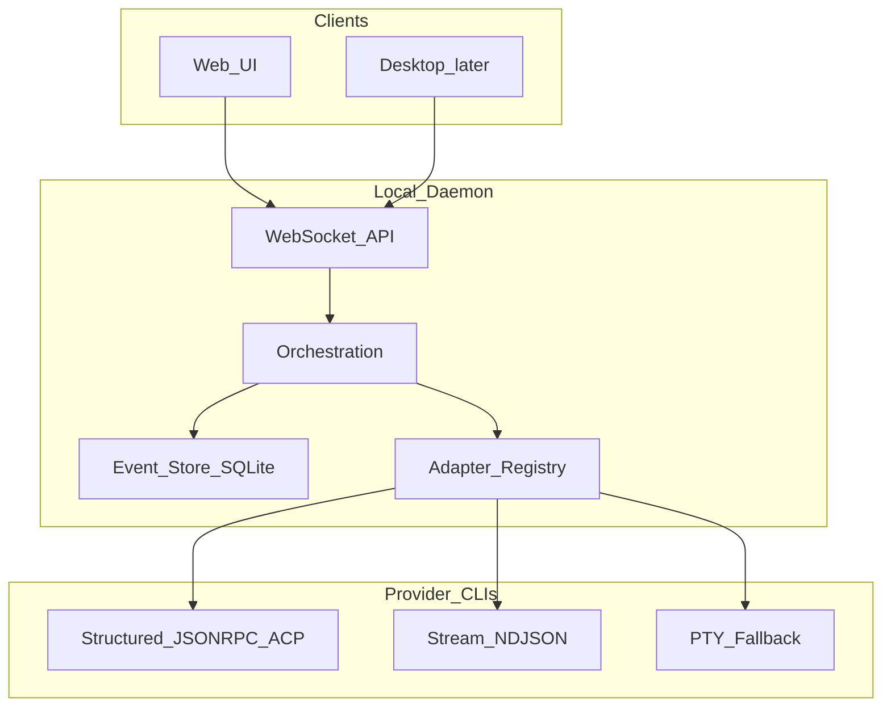

# Architecture overview

Divisio is a **local daemon** that owns provider processes and workspace state, plus **clients** that speak a typed WebSocket protocol. Providers are external CLIs; Divisio never replaces them.

## System diagram



## Layers

| Layer | Responsibility |
| --- | --- |
| Clients | Session UX, rendering, input, local UI state |
| WebSocket API | Auth/pairing, request/response, push events |
| Orchestration | Commands → events → projections; session lifecycle |
| Adapter registry | Resolve provider → adapter; normalize runtime events |
| Providers | Real agent work (tools, FS, shell) under user auth |

## Planned package layout

Greenfield monorepo (not created until Phase 0):

```
apps/
  server/          # Node daemon: WS, orchestration, adapters host
  web/             # React + Vite UI (three-pane design system)
  desktop/         # Tauri shell (Phase 3) — artifact < 150 MB
packages/
  contracts/       # Schemas only: commands, events, provider kinds
  adapters/        # First-party adapters + shared adapter helpers
  shared/          # Runtime utils (git, paths, validation) — subpath exports
```

Rules:

- `contracts` has **no** heavy runtime logic
- Provider-specific process/protocol code lives under `adapters` (or `server` until split is clean)
- UI must not import server internals; only `contracts` + client runtime helpers

## Data on disk

Default home (name may change with branding):

- `~/.orchestrator/userdata/` — SQLite event store + projections, settings
- Project paths remain user-owned directories; Divisio stores references, not copies of repos

Dev/isolation: worktree-local `--home-dir` so agents and humans never share live state by accident.

## Design priorities

1. Performance of streaming and list rendering
2. Predictable behavior on reconnect, interrupt, and partial streams
3. Adapter boundary absorbs vendor chaos
4. Local-first security — see [security.md](security.md)

## Related docs

- [Adapter protocol](adapter-protocol.md)
- [Orchestration](orchestration.md)
- [WebSocket protocol](ws-protocol.md)
- [Surfaces](surfaces.md)
- [Security](security.md)
- [Performance](performance.md)
- [Design system](../design/README.md)
