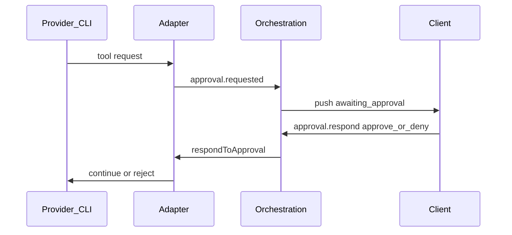

# Permissions

Divisio mediates dangerous provider actions so users keep control without abandoning agent speed.

## What is actually mediated today

Mediation requires the CLI to hand Divisio a decision point. Only adapters that
declare `capabilities.approvals = true` do; for the rest the vendor CLI owns
permissions and Divisio can only choose which mode to launch it in.

| Adapter | `approvals` | What supervised means today |
| --- | --- | --- |
| Codex | `true` | Real approve/deny in the UI, over JSON-RPC |
| Claude | `false` | CLI runs its own engine in `--print`; prompting tools are auto-denied. WebSearch/WebFetch are allowlisted so they are not |
| Cursor | `false` | CLI-owned; full access maps to `--force` |
| Grok | `false` | CLI-owned; full access maps to `--always-approve` |
| Qwen, OpenCode | `false` | Mode is not expressible on the CLI at all — the control is inert in both directions |

The composer surfaces this rather than hiding it: when `approvals !== true` the
approval bar says the CLI owns approvals. **Do not add an approve/deny dialog
for an adapter that cannot honor it** — a control that does nothing is worse
than an absent one.

## Modes

| Mode | Behavior |
| --- | --- |
| **Supervised** | Mutating tools require explicit approve/deny in the UI — on mediating adapters. Elsewhere, the strictest mode the CLI offers |
| **Full access** | Mutating tools proceed without per-call prompts (still subject to OS permissions) |

Default for new projects: **supervised**. Users may change per project or per session (exact UX in Phase 1).

Changing the mode takes effect on the **live** session. Adapters may implement
`setPermissionMode` to reconfigure a running process (Claude does this over its
control channel); those that bake the mode into spawn argv have their session
restarted instead, resuming from the persisted vendor session id.

## Approval flow

## Request categories (initial)

| Category | Examples | Supervised |
| --- | --- | --- |
| `fs.write` | Create/edit/delete files | Prompt |
| `fs.read` | Read files | Allow (may tighten later) |
| `shell.exec` | Run commands | Prompt |
| `network` | Outbound fetches if exposed | Prompt when distinguishable |
| `mcp` / external tools | Vendor-specific | Prompt if mutating |

Adapters map vendor permission events into these categories. If a vendor only offers a coarse “allow tool” signal, use the coarse mapping and document it in the capability matrix.

## UX requirements

- Show command/path summary before approve
- Deny leaves session usable (ready), not crashed
- No approval timeout. A pending approval is cleared by an explicit response,
  by Stop (which cancels the outstanding RPCs so the CLI is not left waiting),
  or by session teardown. An unanswered approval blocks its turn indefinitely
  by design — silently timing out a decision the user has not made would be a
  worse failure than waiting.
- Full-access mode clearly labeled as higher risk

## Non-goals (MVP)

- Mandatory sandbox containers
- Enterprise policy engine
- Network allowlists beyond what providers already enforce

## Related

- [Security](../architecture/security.md)
- [Orchestration](../architecture/orchestration.md)
- [MVP](mvp.md)
