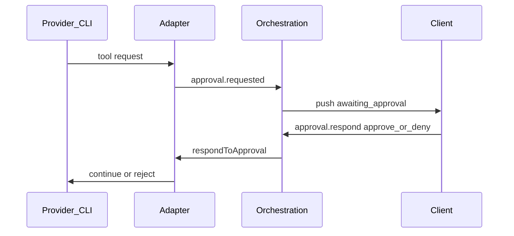

# Permissions

Divisio mediates dangerous provider actions so users keep control without abandoning agent speed.

## Modes

| Mode | Behavior |
| --- | --- |
| **Supervised** | File writes, shell, and other mutating tools require explicit approve/deny in the UI |
| **Full access** | Mutating tools proceed without per-call prompts (still subject to OS permissions) |

Default for new projects: **supervised**. Users may change per project or per session (exact UX in Phase 1).

## Approval flow

## Request categories (initial)

| Category | Examples | Supervised |
| --- | --- | --- |
| `fs.write` | Create/edit/delete files | Prompt |
| `fs.read` | Read files | Allow (may tighten later) |
| `shell.exec` | Run commands | Prompt |
| `network` | Outbound fetches if exposed | Prompt when distinguishable |
| `mcp` / external tools | Vendor-specific | Prompt if mutating |

Adapters map vendor permission events into these categories. If a vendor only offers a coarse “allow tool” signal, use the coarse mapping and document it in the capability matrix.

## UX requirements

- Show command/path summary before approve
- Deny leaves session usable (ready), not crashed
- Timeout policy TBD in Phase 1 (must not hang forever without UI)
- Full-access mode clearly labeled as higher risk

## Non-goals (MVP)

- Mandatory sandbox containers
- Enterprise policy engine
- Network allowlists beyond what providers already enforce

## Related

- [Security](../architecture/security.md)
- [Orchestration](../architecture/orchestration.md)
- [MVP](mvp.md)
